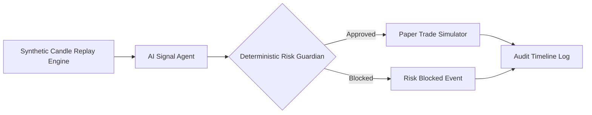

# VibeTrade Backend Engine ⚡

> **Hackathon Track**: *"Building Intelligent Agentic Workflows to Revolutionize Core Intraday Trading Systems"*
>
> ⚠️ **SAFETY DISCLAIMER**: This application is a **paper-trading demo** built strictly for hackathon demonstration. It uses synthetic market data and **NEVER** connects to any live broker, financial exchange, bank account, or real trading API. All orders are simulated locally.

---

## 📌 Executive Summary & Main Architecture

VibeTrade introduces an intelligent human-in-the-loop copilot architecture for intraday trading:
1. **AI Signal Agent**: Analyzes live high-frequency candles (price vs. VWAP, volume ratios, rolling volatility) and generates structured signal proposals (`WATCH_LONG`, `EXIT_WATCH`, `NO_TRADE`) with confidence scores, reasons, and risk explanations.
2. **Deterministic Risk Guardian**: A hard, zero-LLM-override risk gate that programmatically evaluates 6 fundamental risk checks (confidence, volatility ceiling, notional value, daily max drawdown, position limits, stop-loss configuration).
3. **Paper Trade Simulator**: Computes realistic trade execution parameters including 0.1% slippage, transaction fees, and multi-candle future exit P&L calculation.
4. **Replay Engine & Audit Log**: State-managed 30-candle historical replay engine with chronological audit event tracking for transparency and regulatory compliance.



---

## 🛠️ Tech Stack & Dependencies

- **Language**: TypeScript (ES2022 / NodeNext)
- **Framework**: Express.js
- **Runtime**: Node.js v18+
- **Dev Tooling**: `ts-node-dev`, `cors`, `dotenv`

---

## 🚀 One-Command Quick Start

### 1. Clone & Install Dependencies
```bash
cd vibetrade-backend
npm install
```

### 2. Configure Environment (Optional LLM Key)
Copy `.env.example` to `.env`:
```bash
cp .env.example .env
```
*(Optional: Set `OPENAI_API_KEY=your_key` if you wish to test live LLM natural language reasons. If omitted or invalid, the Signal Agent seamlessly uses robust deterministic fallback reasons).*

### 3. Run Backend Server
```bash
npm run dev
```
*Server will start at `http://localhost:5000` with CORS enabled for your frontend dev server.*

### 4. Run Automated Component Tests
```bash
npm test
```

---

## 🎯 Rehearsing the 4-Minute Judging Demo

This backend includes built-in scenario shortcuts to make your hackathon presentation seamless:

| Candle Index | Scenario Name | Market Conditions | Expected Outcome |
|---|---|---|---|
| **Candle 11** | **Breakout Approved** | Close=$98.60 (above VWAP $96.50), Volume Ratio=2.45x (>1.8x), Volatility=0.024 (<0.05) | **APPROVED (PAPER)** – Signal `WATCH_LONG`, Risk Gate Passes, Trade Executed |
| **Candle 21** | **High Volatility Risk** | Price momentum spike, but Volatility=0.078 (>0.05 limit) | **BLOCKED BY RISK** – Volatility check fails, Risk Guardian blocks order |

### API Jump Command for Demo:
To jump directly to Candle 11 during judging:
```bash
curl -X POST http://localhost:5000/api/replay/jump -H "Content-Type: application/json" -d '{"index": 11}'
```

---

## 🛡️ Risk Guardian Rules (Strictly Deterministic)

> **CRITICAL DIRECTIVE**: The Risk Guardian logic in `src/services/riskGuardian.ts` is strictly deterministic. The LLM is **NEVER** allowed to override, bypass, or alter these rules.

1. **Confidence Rule**: Rejects if signal confidence < `0.70`.
2. **Volatility Rule**: Rejects if market rolling volatility > `0.05` (5.00%).
3. **Notional Value Rule**: Rejects if proposed order notional > `$100,000`.
4. **Daily Max Drawdown Rule**: Rejects if cumulative daily P&L <= `-$5,000`.
5. **Position Size Rule**: Rejects if calculated shares <= `0`.
6. **Stop-Loss Rule**: Rejects if stop-loss configuration is omitted.

---

## 📄 API Reference & Frontend Integration

Refer to [`API_DOCUMENTATION.md`](./API_DOCUMENTATION.md) for full endpoint specifications, JSON request/response payloads, and frontend TypeScript interface definitions.

---

## ⚖️ Safety & Compliance Disclaimer

This software is created solely for educational and hackathon demonstration purposes.
- **NO LIVE TRADING**: Contains no broker credentials, financial API keys, or live ordering capability.
- **SYNTHETIC DATA**: All market prices, indicators, and volume metrics are synthetically generated.
- **NOT INVESTMENT ADVICE**: None of the signals or outputs constitute financial advice or real-market recommendations.
